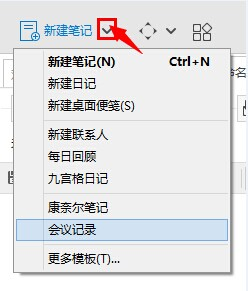
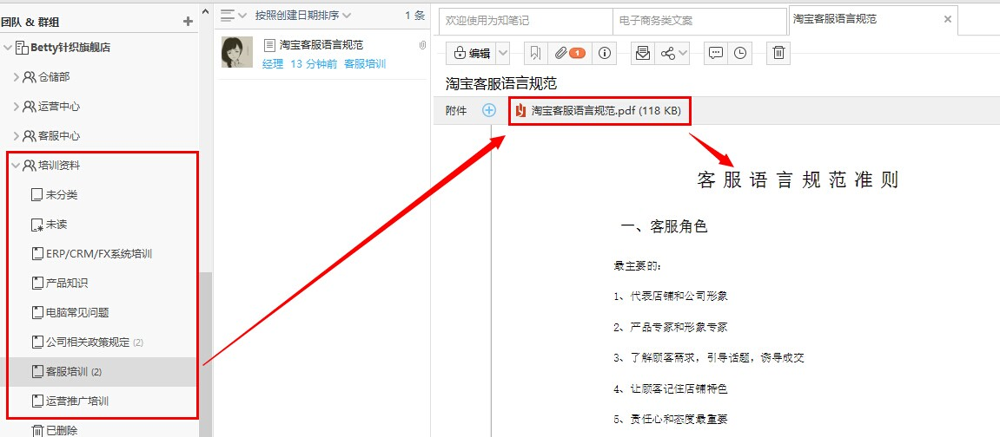
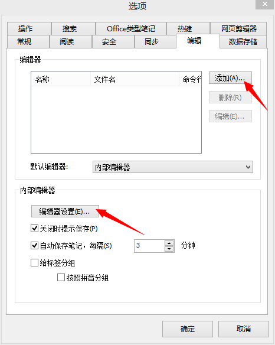
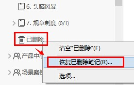

##新建各种类型笔记
为知笔记（ Windows版）为您提供多种新建类型，包括：空白笔记、模板笔记、桌面便签、任务列表、日历、markdown笔记、导入其他多格式文件笔记等
#### 新建空白笔记
空白笔记给用户提供了更大的操作空间，用户想要写什么内容都可以自定义：

+ 打开客户端，点击“新建笔记”，即可创建新笔记。
+ 快捷键 Ctrl+N 或全局热键Ctrl+Alt+N（可单独打开一个窗口哦）
+ 在左栏目录树中选中某文件夹-> 右键-> 新建笔记”等多种方式

####新建模板笔记
新建模板笔记的方法与新建空白笔记类似，在新建笔记按钮旁的下拉菜单里有很多模板，点击即可按此模板新建笔记了。 

**预置模板包括**：为知笔记提供了日记、联系人、每日回顾、九宫格日记、康奈尔笔记等模板，方便大家的使用。

**注：**为知笔记还支持**自定义笔记模板**，了解详情可以点击：[如何自定义笔记模板](http://blog.wiz.cn/faq-templates.html)

####导入文件时转化为笔记正文
文件导入时转化为笔记正文，使得阅读笔记时能更快更直观地浏览到附件的内容。
+ 纯本文类如txt文件，图片类如jpg/png等格式文件不需要设置就可以转成为笔记正文。
+ office类型、pdf类型文档直接拖拽到目录下即可显示正文。但自动转化还需要本机安装了office（office需要是完整版）和相应的PDF阅读器；

####桌面便签、任务列表、日历笔记
为知笔记提供了非常方便的桌面便签、任务列表和日历，如何使用这些笔记点击：[如何新建桌面便笺、任务列表、个人笔记日历](http://blog.wiz.cn/wizsticker.html)

####新建markdown笔记
如果我们想用简单的方式写出格式良好易读的笔记，可以用 markdown 来实现。为知笔记支持 markdown 的渲染，用简单的语法就可以写出赏心悦目的笔记……

了解详细使用请点击：[如何用 markdown 写出格式良好的笔记？](http://blog.wiz.cn/feature-markdown.html)

##编辑笔记

阅读笔记时，点击编辑图标，进入编辑状态。

####Windows客户端常用内部编辑器介绍：

#####1.常用操作

+ **保存按钮：**快捷键Ctrl+S，只是保存，不转到阅读模式； 
+ **HTML 模式**：以html模式查看笔记，直接修改html代码可修改笔记内容； 
+ **清除格式：**可清除颜色、斜体、粗体、下划线等样式； 
+ **插入清单：**快捷键为Ctrl+O插入； 
+ **插入代码：**可以插入不同类型的代码，并将代码高亮； 
+ **撤销：**撤销上一步操作； 
+ **重做：**将上一步操作撤消后，点击该按钮，可以恢复上一步操作； 

#####2.字体格式
+ **样式：**对不同的文字进行标题、段落等的设置，同word里的样式功能； 
+ **字体：**选择字体； 
+ **字体大小：**选择字号； 
+ **B：**粗体，快捷键为Ctrl+B； 
+ **I：**斜体，快捷键为Ctrl+I； 
+ **U：**下划线，快捷键为Ctrl+U； 
+ **文字颜色、背景色：**默认文字颜色为黑色，背景色为白色； 

#####3.对齐方式

+ **左对齐、居中、右对齐**设置对齐方式； 
+ **数字列表、未排序列表：**制表符tab键可以增加缩进，使其变成子级列表； 

#####4.插入内容
+ **插入图片：**选择图片插入，更方便的方法是在编辑状态下直接拖入图片插入； 
+ **截取屏幕：**可以截取屏幕内容到当前笔记； 
+ **插入日期/时间:**会自动调取系统时间插入，快捷键为Ctrl+;，还可以按下Shift+Crtl+;插入其他时间格式或设置默认格式； 
+ **插入表格：**可以新建简单的表格，并设置宽度是固定的还是可变的； 
+ **插入链接：**快捷键为Ctrl+K，可以插入网址、笔记里的书签、其他笔记或附件，插入其他笔记时还有较方便的方法，拖拽其他笔记过来就可以了。 

#####5.增减设置
+ **删除线：**选中部分文字，点击此按钮，可添加删除线。 
+ **下标、上标：**将选中的文字变为下标或上标； 
+ **两端对齐：**调整文字的水平间距，使每一行向页面两端对齐； 
+ **增加、减少缩进：**缩进快捷键为Tab； 

#####6.其他
+ **书签：**选中某些文字，设置书签，结合上面的插入链接，其他文字可以链接到这个书签处； 
+ **查找：**快捷键为Ctrl+F； 
+ **替换：**快捷键为Ctrl+H； 
+ **格式化字体：**将字体格式化
+ **编辑器设置**——启用默认字体设置，即可设置字体、字号、行高还有文字的颜色和背景色了。文字的背景色更换后整个笔记区的背景色都将相应地变化。
+ ***自定义内部编辑器设置：***
可以通过自定义工具栏，调用更多的编辑属性，并且可以自定义调整顺序

  + 方法：点击后面“》”更多按钮->自定义工具栏->添加更多或者调整顺序

#####外部编辑器的添加

为知笔记支持外置的编辑器来编辑笔记，打开菜单->选项->编辑 选项卡，添加其他编辑器。添加完成后如果需要每篇笔记都自动用外部编辑器打开，可以设置默认编辑器为这个编辑器。

####插入待办清单
为知笔记支持代办清单功能，如图

**1.待办清单介绍**

+ 对于个人用户来说，你可以用待办清单记录你每天计划做的事情，计划完成的工作任务等等。

+ 对于团队协作来说，待办任务的完成状态是个结果性的标识，最终能够对协作和团队成员有重要帮助的，还是任务的执行过程，包括方案的选择和这样选择的原因，这些才是对团队最有价值的东西。所以为知笔记的待办清单更强调任务的一个执行过程。

  + 创建待办清单，将任务笔记发送消息给相关人，任务执行者的操作非常简单，勾选checkbox，即可标记任务完成，并记录人员和完成时间，关注任务最核心内容
  + 通过笔记评论和消息机制，跟踪任务执行过程中的问题、思路
  + 拖动其他相关笔记到任务正文，将与任务相关的笔记关联起来，例如任务来源、会议讨论记录、可参考的文档等

**2.如何使用待办清单进行协作**

①创建待办清单笔记，在编辑界面，选择 checkbox 按钮，创建待办清单 （个人笔记按这个步骤创建待办清单列表即可） 

②通过标题或评论@相关人员（如待办清单图），发送任务通知消息 
③利用多人编辑，评论记录工作过程 
④任务清单完成后，勾选复选框，自动记录执行人和执行时间

####添加笔记链接
+ 内链接：笔记和笔记之间的关联，可以将两篇笔记关联起来
 + 添加内链接笔记：在编辑笔记时，选中要链接的笔记拖拽到笔记的相应位置即可。如图

+ 外链接
 + 如果笔记本身是网页，且网页里包含外链接。
 + 如果是自己添加链接地址到笔记里点击空格或者换行即可生成链接。

####编辑附件
导入到为知笔记的附件，如word，可以点击打开直接编辑，保存后笔记内容同步更新。

##删除笔记

+ 右键点击笔记列表选择删除
+ 点击删除图标即可删除笔记。

####恢复已删除笔记：

为了防止误删除导致笔记无法找回，Windows客户端还提供了“恢复已删除笔记”功能，里面包含你近期在网页版、移动端或电脑端已删除文件夹里面删除的笔记和附件，可恢复回来。 

右键点击已删除目录->恢复已删除笔记

注意：
+ 可恢复的前提是你删除的笔记在删除前进行过同步，即在服务器里存在过。若本地的笔记在同步上传前就彻底删除了，就不能通过这个方法找回。
+ 恢复企业群组里的笔记需要超级用户及以上权限的成员才可以操作

