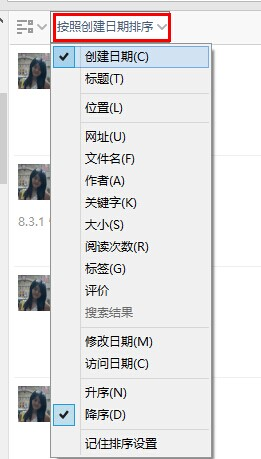

##阅读笔记

在各个客户端新建的笔记，或通过网页、微信、微博收藏的笔记，都可以在手机端直接浏览查看！阅读笔记，可以查看笔记内容、笔记信息、笔记所带的附件、也可以分享给朋友或分享到群组，当然也可以删除。

#### 左侧目录树结构
为知笔记目前通过和Windows资源管理器类似的多级目录结构展现。用户可以快速找到自己分类的文件夹找到笔记。
+ 个人笔记：通过自己的习惯搭建的目录结构。为知笔记还内嵌了几个默认的目录：
    + 微信收藏

    + 发消息、链接、图片、声音等内容给为知笔记的微信公众账号，内容都会自动保存到为知笔记的微信收藏目录

    + 开启了为知笔记设置里的“复制微信内容保存到为知笔记“的选项后，在微信中复制的链接内容，都会自动保存到为知笔记

        了解详情点击:[如何保存微信内容到为知笔记？](http://blog.wiz.cn/wiz-wechat.html)

    + 微博收藏

        + 看到新浪微博中有价值的内容，想保存下来，只有@保存到为知笔记，内容都会自动保存到为知笔记的微博收藏目录

    + 我的邮件

    + 不管是为知笔记的个人用户还是企业用户，每个人都有自己的个人 mywiz 邮箱，如果你发邮件给你的个人mywiz邮箱，内容都会自动保存到我的邮件目录的
        更多有关mywiz邮箱请点击：[mywiz邮箱使用方法](http://blog.wiz.cn/wiz-mywiz.html)
    + 另外还有桌面便签、任务列表等
+ 团队&群组
    + 企业群组：存放自己创建的企业群组和被别人加入的企业群组目录树结构
    + 个人群组
        + 我的群组：存放的是自己创建的个人群组
        + 其他群组：存放的是被别人添加的个人群组

+ 笔记列表排序：可以通过创建日期、修改日期、访问日期、评价等对笔记列表的排序方式,如下图

    

####浏览笔记内容
+ 查看笔记内容：可以直接查看编辑的内容；点击打开附件正文或者直接在笔记里浏览附件正文。
+ 打开一篇笔记，查看笔记属性信息
    + 点击标题上方菜单栏的“i” 图标，查看笔记所在目录、笔记大小、笔记创建时间、最后修改时间

        

+ 浏览评论：点击评论按钮即可打开评论内容

    + **对于个人笔记**，这里的评论相当于笔记备注，可以对笔记通过备注的方式补充笔记内容，也可以将自己查看笔记后的感想写在备注里
    + **对于群组笔记**，评论功能是浏览了团队成员的笔记后的的看法，和团队成员之间的沟通是基于笔记的一个沟通，沟通记录会一直和笔记关联在一起，后期方便查找。
