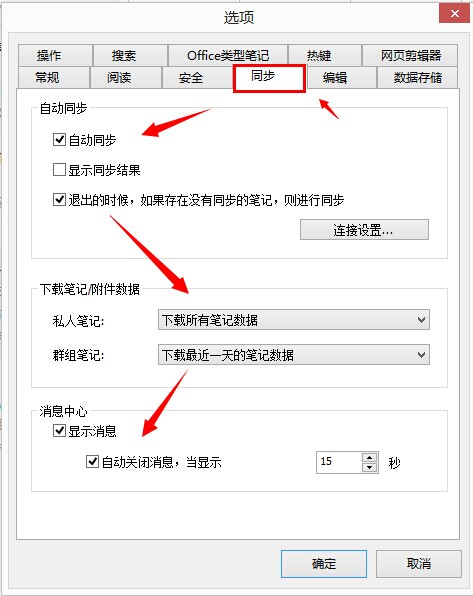

## 同步
为知笔记是以云同步为基础的笔记产品，可以在多个终端上使用，笔记在各个终端上最终保持一致，那么笔记是怎么进行同步的呢？

####同步方式：
在同步时，为知笔记会自动检查本地笔记与服务器上笔记做的更新（笔记的增删改都属于更新），若本地做了更新，将会上传到服务器覆盖原有版本；若服务器上有了更新，则会将新的笔记版本下载到本地。

- 即时同步：笔记在本地更新后，在笔记列表中会出现一个向上的待上传的箭头，网络情况良好的情况下，这个箭头马上消失，这就是为知笔记的即时同步功能，使服务器上的笔记尽量保持最新状态。
- 自动同步：一般情况下，为知笔记会每15分钟进行一次全面的同步。
- 手动同步：由于自动同步有一个时间间隔，你也可以手动执行同步操作，点击为知笔记左上角头像右侧的同步按钮，或快捷键F9即可开始手动同步。
- 退出时笔记自动同步：为了防止笔记有更新后直接退出为知笔记，导致忘了执行同步或没同步完的情况发生，在退出为知笔记时，笔记会自动同步，在同步完成后自动退出为知笔记或关闭电脑。

####同步机制

1. 在为知笔记客户端写的笔记信息，首先会保存在本地，同步之后保存到服务器；
2. 同一篇笔记在不同客户端编写会保存最后一个客户端同步成功的内容（注：经常手机电脑切换编辑同一篇笔记的用户，在使用另一客户端编辑笔记时一定要确保另一客户端已经同步成功）
3. 企业服务群组用户和团队成员同时编辑一篇笔记时，服务器上默认保存的版本是最后一个人上传的版本。（注：为了防止版本冲突发生，若您的团队成员正在编辑一篇笔记，您阅读此篇笔记时，会提示您对方正在编辑，此时请不要编辑，待他同步之后再编辑）

####同步设置：
在Windows客户端 菜单->选项->同步中，有详细的同步设置项，你可以在这里开启或关闭自动同步和退出自动同步。 
为了获得最需要的笔记数据并且不浪费资源，你可以在这里设置同步时下载哪一部分笔记。没有下载下来的笔记上会呈现一个绿色向下箭头的待下载标志，点击阅读笔记时会自动下载。

####同步流量限制：
为知笔记不限制个人笔记的总空间，但对每月个人笔记的上传流量有规定。免费用户每月流量限额500M起，VIP用户每月流量限额10G起，该流量限制额度均可以通过积分的提升而增加。当达到流量限制时，个人笔记无法进行有效的同步。流量统计是从每个自然月的1号开始的，1号时之前累积的流量值会清零。
