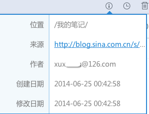
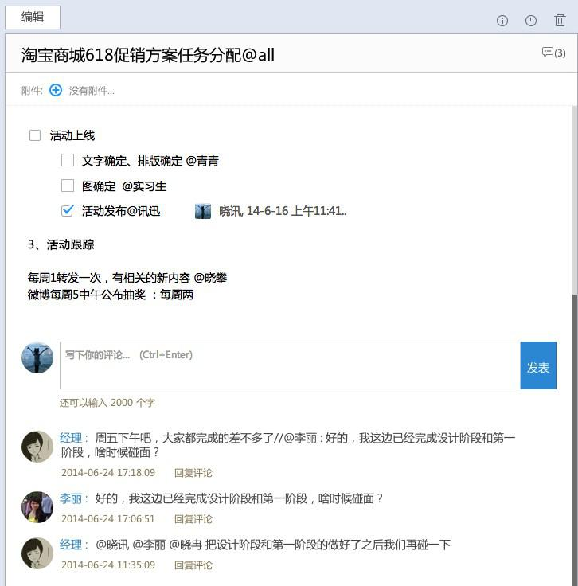

##阅读笔记
####阅读笔记信息

选择需要阅读的笔记，点击右上角的笔记信息，在弹出窗口中，可查阅笔记所在位置、作者、创建日期、修改日期等信息

> 来源：显示通过网页剪辑器保存的网页原始地址

#### 评论

网页版阅读笔记时，正文下方为评论区域

####标签

1. 添加标签

点击“编辑”笔记，选择“标签”，在弹出窗口中选择已有标签，或输入新标签后点击回车添加 
 

1. 删除标签
访问网页版，在个人笔记--目录栏中，展开标签，右键点击想要删除的标签，可选择删除、重命名标签，也可新建标签和子标签 
 

####微信收藏

通过微信收藏的网页、链接、图片等，默认保存在“个人笔记--微信收藏”目录下

了解详情点击:[如何保存微信内容到为知笔记？](http://blog.wiz.cn/wiz-wechat.html)
#### 微博收藏

通过@保存到为知笔记，收藏的微博，默认保存在“个人笔记--微博收藏”目录下
#### 我的邮件

使用mywiz邮箱保存的邮件，默认保存在“个人笔记--我的邮件”目录下，群组mywiz邮箱转发的笔记，保存在“群组名称--群组邮件”目录。

更多有关mywiz邮箱请点击：[mywiz邮箱使用方法](http://blog.wiz.cn/wiz-mywiz.html)
