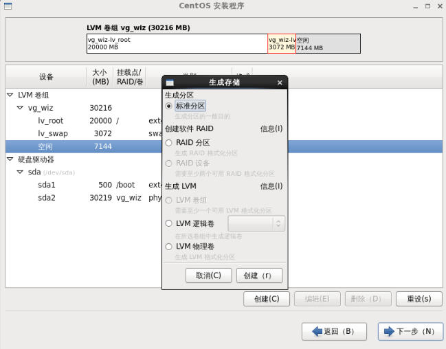
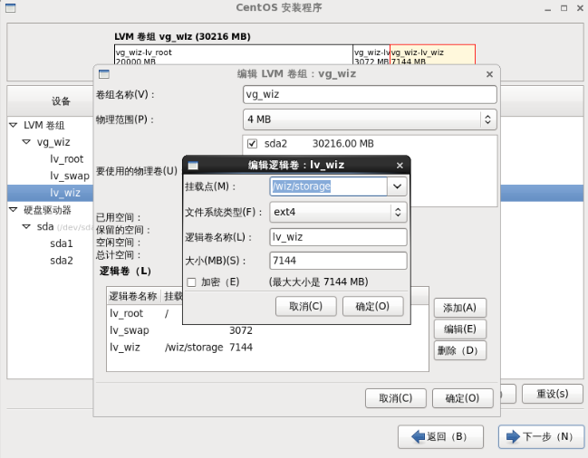
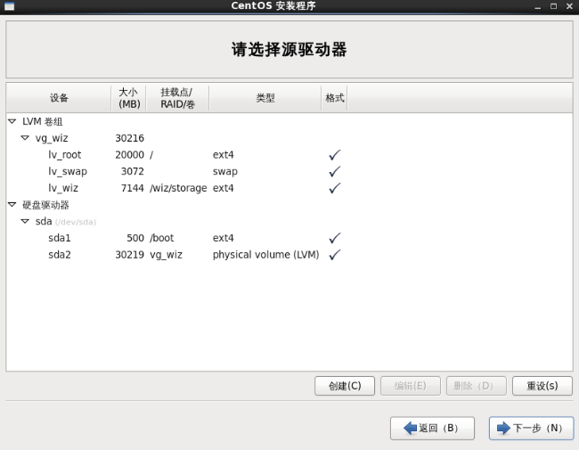

## 存储方案

### 硬盘规划

为知笔记私有部署注册用到两个目录，服务部署在/wiz目录下，所有的数据存储在/wiz/storage目录下

#### 系统盘

系统盘大小不要求太多的空间，用一般的配置即可

#### 数据盘

建议根据自己的需求估算所需的数据盘容量，作为独立存储单独挂载到/wiz/storage，有经验的团队可以使用RAID方案保障数据的安全，如果不使用RAID，需要定期备份数据，避免因硬盘损坏导致数据丢失

### 硬盘扩容方案

通常情况下，只要规划硬盘容量时做好预估，不会遇到存储空间不足的问题

如果有扩容的要求，可以在部署时采用LVM逻辑卷管理硬盘，方便将来扩容

使用逻辑卷管理可以在操作系统安装时配置，也可以安装完成以后进行配置

安装以后配置LVM逻辑卷需要使用命令行操作，建议有经验的用户使用，下面以操作系统安装过程中设置LVM进行演示

在安装过程中的[选择安装类型界面](./centos.html#install-type)，勾选左下角的“查看并修改分区布局”，在下一步中将进入分区布局设置界面

选中空闲分区，点击“创建”按钮，新建分区

选择“LVM逻辑卷”，点击创建，挂载点填入'/wiz/storage'，逻辑卷名称选择一个有意义的名称，大小填入给数据磁盘分配的大小

创建完成后如图所示，可以看到空闲分区变成了逻辑卷lv_wiz

